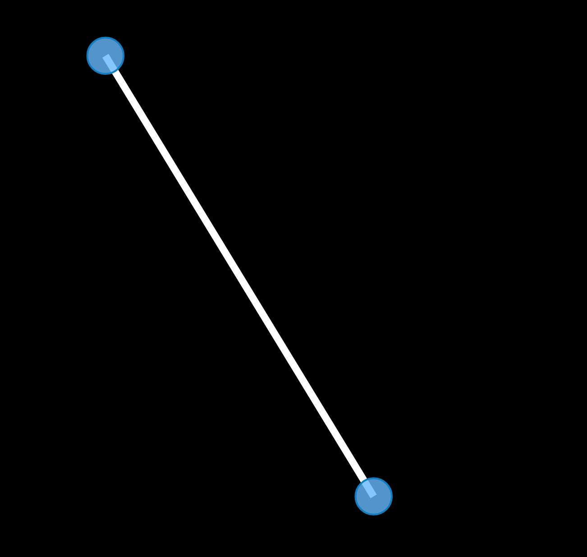

# Philosophy
Alchemy.js is a graph drawing application, built almost entirely in [d3](http://d3js.org/).

Alchemy.js was built so that developers could easily get up and running with Graph visualization applications, and minimal over head.  Minimal code is actually required to get Alchemy.js graphs up and running with most projects, since altering the default configuration takes a priority over actual implementation through JavaScript.

Additionally, Alchemy.js is built with d3 so that the core application can easily be extended with any of the other features included in d3.

# Quick Start
Alchemy.js requires 3 things, **data**, **alchemy.css**, and **alchemy.js**.

Here is the easiest way to get alchemy.js up and running: 

* ** Download and include Alchemy.js: **

```html
<link rel="stylesheet" type="text/css" href="path/to/vendor.css">
<link rel="stylesheet" href="path/to/alchemy.css">

<script type="text/javascript" src="path/to/vendor.js">
<script type="text/javascript" src="path/to/alchemy.js">
```

* ** Provide Alchemy.js with a graphJSON dataSource: **

```json
some_data = 
    {
      "nodes": [
        {
          "id": 1
        },
        {
          "id": 2
        }
      ],
      "edges": [
        {
          "source": 1,
          "target": 2
        }
      ]
    }
```
* ** start Alchemy.js: **
```js
alchemy.begin({dataSource: some_data})
```

* ** Be amazed: **    


<!-- // #What's Included
// Release:

// **`alchemy.js`**: is a compilation of all files in the **[alchemy](https://github.com/GraphAlchemist/Alchemy/tree/master/app/scripts/alchemy)** directory.  This includes the **alchemyConf** file, which includes all of the alchemy defaults.  Read more about how to override defaults [[here|Overriding-Defaults]]    

// **`alchemy.css`** contains all of the default styles for the alchemy graph application.  Default styles can be overidden by providing custom css *after* alchemy css and vendor css.    

// Development:    
// `tree -I 'bower_components|404.html|images|robots.txt|favicon.ico|index.html'`
// ```
// .
// ├── sample_data
// │   └── charlize.json
// ├── scripts
// │   └── alchemy
// │       ├── alchemyConf.coffee
// │       ├── errors.coffee
// │       ├── filters.coffee
// │       ├── init.coffee
// │       ├── interactions.coffee
// │       ├── layout.coffee
// │       ├── search.coffee
// │       ├── startGraph.coffee
// │       ├── styles.coffee
// │       ├── update.coffee
// │       ├── utils.coffee
// │       └── visualcontrols.coffee
// └── styles
//     ├── alchemy.css
//     └── main.scss
// ```


// # Quick Start    
// ###Include Alchemy in your app:    
    
// Download most recent [Alchemy release](#).

// Add it to index.html


//     <link rel="stylesheet" href="path/to/alchemy.css">
//     ...
//     <script type="text/javascript" src="path/to/vendor.js">
//     <script type="text/javascript" src="path/to/alchemy.js">
  

// ```
// <link rel="stylesheet" href="path/to/alchemy.css">
//     ...
// <script type="text/javascript" src="path/to/vendor.js">
// <script type="text/javascript" src="path/to/alchemy.js">
// ```
    
//     <center> --- OR --- </center>
   
// ```bash
// $ bower install Alchemy --save
    
// ```

// ```html
// <link rel="stylesheet" href="bower_components/alchemy/alchemy.css">
// <script type="text/javascript" src="bower_components/alchemy/Alchemy.js">
// ```

// <br>
// ### Add a Data Source
// Alchemy.js consumes GraphJSON, read more about the formate [here](#).  Define a data source in your conf file or inline after the Alchemy files e.g:  

// ```html 
// <script>
// alchemy.conf = {
//     dataSource: "yourGraphJSON.json"
// }
// </script>
// ```

// ### The Alchemy Div    
// Add an Alchemy div to the page:    

// ```html
// <div class="alchemy"></div>
// ```

// start alchemy from your app:
    
//     <script>
//         userConf = {
//         dataSource: "yourGraphJSON.json"
//         ... your conf settings ... 
//         };

//         alchemy.begin(userConf);
//     </script>


// ### Done!
// Be amazed by your sexy graph visualization.


// #Contributing

// ### Some Things to Know
// Alchemy.js uses [Yeoman.io](http://yeoman.io/) to manage workflow, and their documentation is a great resource to get up and running quickly.

// If you are familiar with Yeoman already, it will be helpful to know how Alchemy's grunt tasks are configured.  The main grunt task, `build`, whether being used in development or to build the dist does the following:  
  
//   1. Copies all coffee script files into `.tmp` directory  
//   2. Concats all of the coffee script files with the `start.coffee` at the beginning and the `end.coffee` file at (you guessed it) the end

  
// In development, there is an `alchemy.src.coffee` file in the `.tmp` directory, making it easy to use mapping files to debug the coffeescript directly.

// ### Overriding Default Functions
// ...

// ### Including Your Code
// We'd love to include that awesome new feature you've built.  Here is the process:  

//   * Fork this repo  
//   * `git clone <my_fork_of_this_repo>`  
//   * `git checkout -b <my_awesome_new_feature>`  
//   * `git branch -D master`  

// When you feel like your contribution is battle ready, run the tests:
// `grunt ...` 
// If everything passes, feel free to submit a pull request.  We may have come conversations about pieces of it, or we may merge it right away.

// ###Contributor Agreement
// Ahead of us merging your code, you will will need to have signed our [contributor agreement](https://docs.google.com/a/graphalchemist.com/forms/d/1ypqMsBPrfzPpvQPXYdfw12u9xK5pNiHeMAuYImzEli4/viewform).  It is pretty minor, feel free to reach out if you have questions.

-->